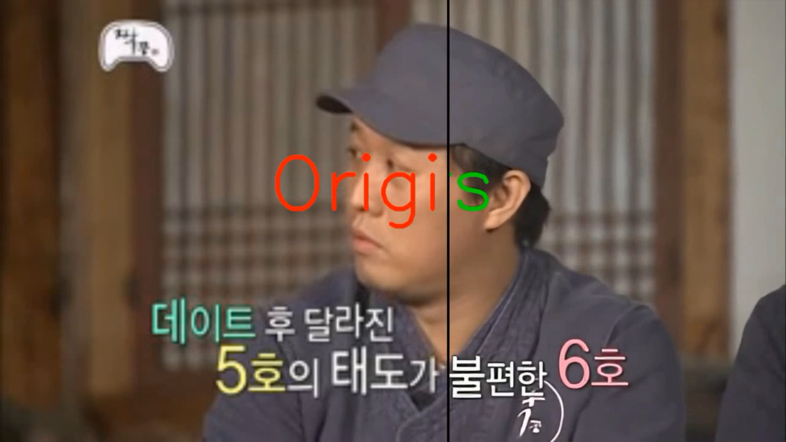

# EDVR in PyTorch

paper : https://arxiv.org/pdf/1905.02716.pdf

> review : https://khyeyoon.github.io/video%20super-resolution%20paper/EDVR/

* This code was written by modifying the code in the link below

> https://github.com/xinntao/BasicSR

# Requirements

- Python >= 3.7 
- PyTorch >= 1.3
- NVIDIA GPU + CUDA

# step

1. pip install -r requirements.txt
2. python setup.py develop

# Train

### Single GPU Training

> PYTHONPATH="./:${PYTHONPATH}" \\\
> CUDA_VISIBLE_DEVICES=0 \\\
> python basicsr/train.py -opt options/train/SRResNet_SRGAN/train_MSRResNet_x4.yml

### Distributed Training

> You need to modify the yml file to match your data path

**8 GPUs**

> PYTHONPATH="./:${PYTHONPATH}" \\\
> CUDA_VISIBLE_DEVICES=0,1,2,3,4,5,6,7 \\\
> python -m torch.distributed.launch --nproc_per_node=8 --master_port=4321 basicsr/train.py -opt options/train/EDVR/train_video_HD.yml --launcher pytorch

**4 GPUs**

> PYTHONPATH="./:${PYTHONPATH}" \\\
> CUDA_VISIBLE_DEVICES=0,1,2,3 \\\
> python -m torch.distributed.launch --nproc_per_node=4 --master_port=4321 basicsr/train.py -opt options/train/EDVR/train_video_HD.yml --launcher pytorch
    
# Self-collection dataset (cartoon, video)

About 30,000 frames were collected through videos in YouTube and used as a dataset

### train/validation dataset format

    dataroot
    ├── subfolder1
        ├── frame000
        ├── frame001
        ├── ...
    ├── subfolder1
        ├── frame000
        ├── frame001
        ├── ...
    ├── ...
    

# Result of training with Self-collection dataset

You can check the result video through the link below

